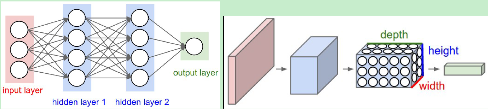

### Neural Networks

在此之前我们学习了一个线性的得分函数（score function），$f=Wx$，现在来介绍神经网络。

一个两层的神经网络（不要当作生物学上的神经网络看待）的例子是：
$$
f=W2max(0, W_1x)
$$

首先通过一个权重矩阵$W_1$，通过一个非线性函数$max$，再通过一个权重矩阵$W_2$得到我们最后的得分函数。之前提过，权重矩阵里的每一行可以看作是一个“模板”，匹配对应类别的图像，现在是两层神经元，情况变得有点不太一样，首先$x$通过权重矩阵$W1$进行模板匹配，得到了对应100个模板的得分，之后再通过权重矩阵$W2$，可以理解为对上一步得到的100个模板的得分进行加权，最后输出10个类别的的得分。（其中的非线性层很重要）

#### 一些激活函数

#### 实现：2个隐藏层的神经网络

------

### 卷积神经网络

我们会使用三种主要类型的layer来搭建卷积神经网络结构：Convolution Layer，Pooling Layer，Fully Connected Layer。通过堆叠这些layer来搭建卷积神经网络结构。

左边是常规的三层的神经网络，右边是卷积神经网络。

输入是$32\times 32\times 3$的图像，和全连接层不同的是，**保留它的空间结构**，卷积神经网络（ConvNet）的每一层都有沿着三个维度（**width, height, depth**）排列的神经元，是一个空间结构，输入输出称为volume。在卷积神经网络结构的最后，会得到比如一个$1\times1\times10$的向量，因为卷积神经网络就是不断减少volume的宽、高，不断加深它的深度。

#### Fully Connected Layer

假设我们有一张输入图像，$32\times 32\times 3$，通过得分函数（将输入图像展开成一列$3072 \times 1$，和权重矩阵$10\times3072$相乘），得到一个$10\times1$的分数向量，在这里，我们将输入图像的每一个像素看作是一个神经元，输出的每一个分数看作是一个神经元，那么输出层的10个神经元和输入层的3072个神经元之间都有权重相连接，所以被称为全连接层（fully connected layer）

#### 一个简单的神经网络结构 [INPUT->CONV->RELU->POOL->FC]

- **INPUT：**$32\times32\times3$，RGB图像
- **CONV：**进行卷积运算，每个神经元对应的权重对输入的volume的局部区域进行点积运算，假设有12个filters（卷积核），可能的输出就是$32\times32\times12$。
- **RELU：**对每个元素应用激活函数，不会改变volume的大小，还是$32\times32\times12$
- **POOL：**在空间维度上（width， height）执行一个下采样操作，$16\times16\times12$
- **FC：**计算一个类别分数，输出的可能size为$1\times1\times10$

这些layer中，CONV/FC包含着参数，神经元的权重和偏置，训练学习得到，RELU/POOL是一个函数，执行函数运算，不包含参数，但CONV/POOL包含着一些超参数，如filter size，stride，padding，max pooling or average pooling。

每个layer都接收一个3D的volume作为输入，经过一个可微函数输出一个3D的volume。

#### Convolution Layer

##### Overview

卷积层的参数就是一个个的filters，这些filters参数是可以学习的。每个filter在空间（width, height）上都很小，但深度和输入的volume保持一致，比如输入是$32\times32\times3$，那么filter的size可能是$3\times3\times3$。在前向传播过程中，filter沿着输入volume的width, height进行卷积运算（点积运算）。每个filter卷积运算完成后，会得到一个二维（在每个通道上卷积的结果相加起来）的激活图（activation map）或者是叫特征图（feature map）。有多少个filter，就会得到多少feature map。将生成的feature map沿着深度方向堆叠我们就得到了输出的volume。

##### Local connectivity

神经元只和输入的volume的局部区域进行连接，这个局部连接的空间范围称为神经元的**感受野（receptive field）**，也是filter size的大小，但这些局部连接会贯穿输入volume的整个深度。

刚刚讨论了神经元的局部连接，下面介绍决定输出的volume大小的超参数：**depth**，**stride**，**zero-padding**。**depth**对应于我们要使用的卷积核的数量。**stride**控制了我们应该怎样在输入volume上滑动我们的filter，当**stride**为1时，filter一次移动一个像素。有时对输入的volume沿着边界补0是很方便的，这个填充0的大小就是一个超参数。

假设输入的volume的size是$W$，filter的size是$F$，stride是$S$，在边界补0的size是$P$，那么就有一个公式计算输出的volume的size：
$$
(W-F+2P)S+1
$$
一般来说，设置zero-padding为$P=(F-1)/2$，同时设置$S=1$，就可以保证输入volume和输出volume有相同的空间（width, height）size。

##### 权值共享

每个深度切片的神经元使用的都是相同的权重和偏置。也就是说，filter在input volume上滑动运算时，里面的参数是不变的，不是说每一次运算都使用不同的参数，只是不同的filter有不同的参数。可以把filter看作是一个个的特征检测器，比如一个检测水平边缘的filter，它对input volume的不同位置去检测有没有一个水平边缘，这时候我们并不需要对input volume中的每一个区域都去重新学习这个检测水平边缘filter的参数。

不过注意，在一些情况下，权值共享假设没有意义，当面对的是一些具有特定中心结构的数据时，在图像的一边应该去学习A特征，而在另一边，应该学习B特征。一个实际的例子当是输入的是一个中心的脸部图像时，我们应该在不同的空间位置学习不同的眼部特征和发型特征，这时候就可以不采用权值共享，仅仅是一个局部连接层。

##### 总结

- 输入：$W_1 \times H_1 \times D_1$

- 需要的四个超参数：$K$（number of filters）$F$（filter size）$S$（stride）$P$（padding amount）。
- 输出：$W_2 \times H_2 \times D_2$

- 公式：$W_2 = (W1-F+2P)/S+1$，$H_2=(H_2-F+2P)/S+1$，$D_2=K$

#### Pooling Layer

它的作用是逐步减小表示的空间大小，以减少网络中的参数和计算量，从而也控制过拟合。池化层对输入的每个深度切片独立操作，并一般使用MAX对其空间大小进行调整。

为了减小图片的尺寸，有人建议用更大步距的卷积层替代池化层，丢弃池化层对于训练良好的生成模型也很重要，如变分自动编码器(VAEs)或生成对抗网络(gan)。似乎未来的架构将会很少或没有池层。

##### Layer pattern

$INPUT \to [[CONV \to RELU]*N \to POOL?]*M \to [FC \to RELU]*K \to FC$

比起一个具有大感受野的filter，堆叠多个具有小感受野的filter可能是更好的选择，比如可以通过堆叠$3个3\times3$的filter代替一个$7\times7$的filter。它们具有相同的感受野，且具有更小的参数量，而且因为在每个卷积后都会进行一个非线性激活，所以堆叠多个卷积核也能带来更多的非线性。假设输入输出的volume的channel都是C，那么$3个3\times3$的filter的参数量就是$3\times3\times C \times3=27C^2$，而$7\times7$的filter的参数量是$7\times7\times C=49C^2$，实际是缺点是需要消耗更多的内存对中间结果进行保存。

当构建一个卷积神经网络时，最大的瓶颈就是内存的限制，因此，我们可以事先粗略估计参数数量，转换为GB，看看能否满足内存运行。

