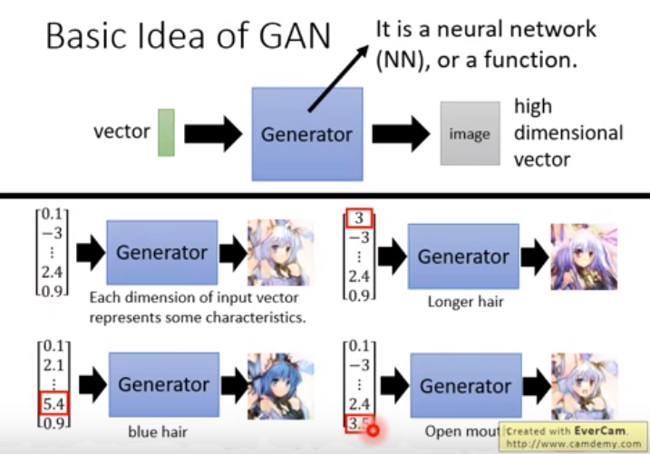
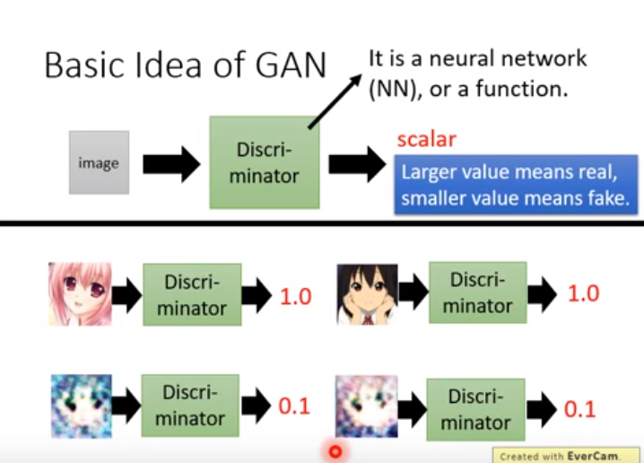
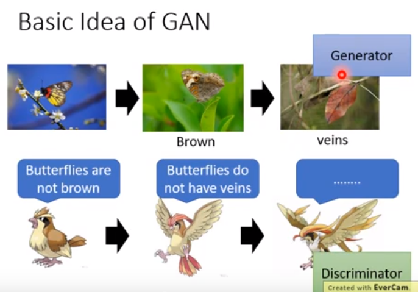
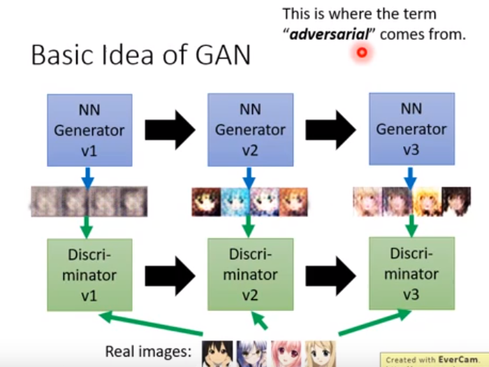
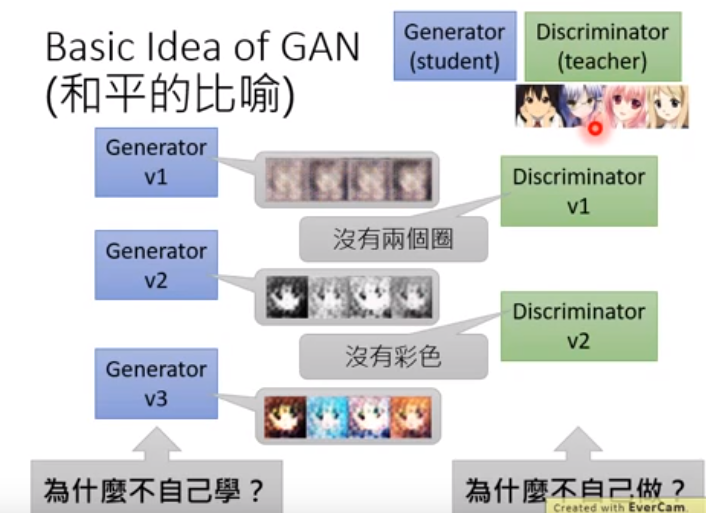
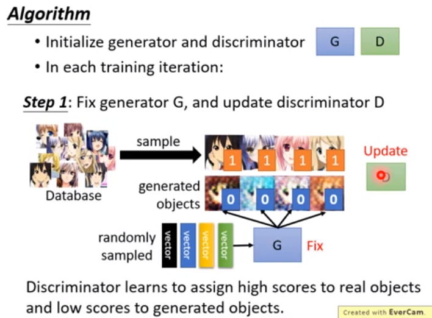

## GAN（Generative Adversarial Network）

GAN，Yann LeCun大神对此技术有非常高的评价，目前已经有了非常多种类的GAN，形成了一个GAN的大家族：[the-gan-zoo](https://github.com/hindupuravinash/the-gan-zoo). 可以看出，GAN成长的速度非常快，并且成为了一种十分重要的技术。

### OUT LINE

- Basic idea of GAN.
- GAN as structured learning.
- Can Generator learn by itself?
- Can Discriminator generate?
- A little bit theory.

#### Generation

我们使用GAN，主要是用于Generation，可以生成图像，也可以生成句子，GAN有一个结构称为Generator。比如说，如果是图像生成的话，我们就可以随机采样一个高斯分布噪声（一个向量），做为Generator的输入，之后会输出一张图像出来，输入不同的向量，就会产生不同的图像出来。这样随机输入生成确实没用很大的作用，但**Conditional Generation**就很有用，比如输入一段描述鸟的话，输入对应的图像出来。

### Basic Idea of GAN

之前提到的Generator，它是一个<u>神经网络（neural network，NN）</u>，或者称为一个<u>函数（function）</u>。输入向量的每一个维度都代表了某一种特征。

GAN网络里还有一个结构叫Discriminator，它也是一个神经网络（neural network，NN），或者说称为一个函数（function）。它可以以一张图像或者说一句话作为输入，它的输出是一个数值（scala）。这个数值越大，说明输入的图片更真实，数值越小，说明输入的图片更假。

在这里，Generator和Discriminator有点像被捕食者和捕食者的关系，

比如说，以二次元动漫人物生成为例子：

然后这里可以提出两个重要的问题，很引人深思，就是：一方面，Generator为什么不自己学习，一定要借助Discriminator吗？另一个方面，Discriminator为什么不自己做，非要去“指导”Gnerator去做生成的工作？

#### Generator vs Discriminator

写作敌人，念作朋友。

#### Algorithm

- 初始化generator和discriminator。
- 在每一个训练的迭代过程中：、
  - 第一步：
    - 固定住generator：G，并且 update discriminator：D，discriminator要学习给真实的对象一个较高的分，同时给生成的对象一个较低的分。

