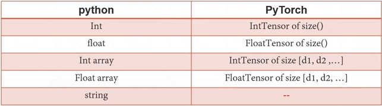

### 张量数据类型（Tensor）



#### 如何表示string?（pytorch没有内建对string的支持）

- 使用one-hot编码。
- 使用一些编码器。

#### 维度为0的张量-标量

常见的标量应用有loss的计算，loss计算出来的结果就是一个标量。

```python
torch.tensor(1.)
```

#### 维度为1的张量-向量

常见的应用有：Bias，神经网络层的线性输入：Linear Input。

#### 维度为2的张量

常用应用：带有batch的Linear Input。

#### 维度为3的张量

适合自然语言中的文字处理。

#### 维度为4的tensor

使用应用于图片，[batch, channel, width, height]。