### 神经网络简介（参考自3blue1brown）

#### 最简单的神经网络 - 多层感知器（以识别手写数字为例）

##### 神经元

可以想象为一个装有数字的容器，神经元中装有的数字表示灰度值，这里灰度值的范围是0~1，0表示全黑，1表示全白。把神经元里装着的数，叫做<u>激活值</u>。激活值越大，神经元也就会越亮。

##### 从第一层和最后一层网络开始

那么，对于一张输入的手写数字的图片，784个像素就构成了网络的第一层。

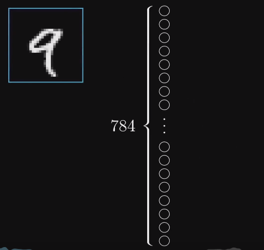

现在跳到最后一层，有10个神经元，分别是0~9，神经元的激活值范围是0~1，表示系统认为输入的图像对应着那个数字的可能性。


那么在中间，就还有几层隐含层。神经网络在运作时，上一层的激活值会决定下一层的激活值。所以神经网络传递信息的机制就是：

> 一层的激活值是通过怎样的运算，算出下一层的激活值的。

##### 探究中间层的奥秘

这里有一个问题就是，为什么我们会认为中间的几层网络可以做到输出数字的可能性的呢？它是怎么识别的？我们可能会期望在中间层的第一层，我们能够识别一些小线段的特征，之后后一层能把小特征组合成数字的一个小部件，像“9“是一个圈圈加上一个线段，然后，在后一层网络就能把小部件组合，识别出数字来，这可能是我们期待它去做的。

那么，按照我们所期待的那样，考虑一个具体的问题，第二层中的某一个神经元是否能够把一条短边给识别出来。

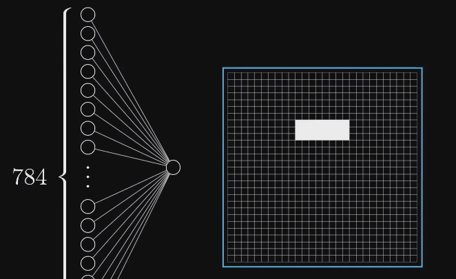

我们将第一层网络中的所有神经元和这个神经元之间连接的线都赋上一个权重（数字），之后，用第一层的激活值分别乘以对应的权重，就得到了一个加权和。那么，我们想到，只要把对应的位置上的神经元赋上一个正权值，其他地方赋上赋的权值，那么，这个值越大，就说明越满足那一条短边。

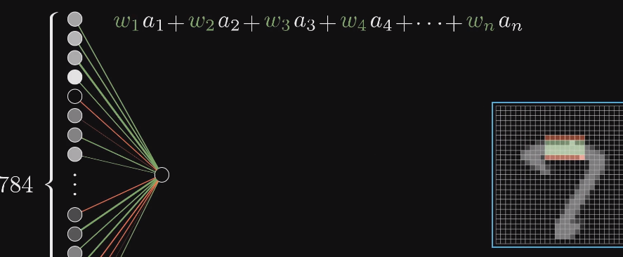

得到的加权值可能是任意大小，但在这个网络之中，我们就需要值在0~1的区间内，所以需要一个函数，变换到0~1的区间之中。sigmoid函数：

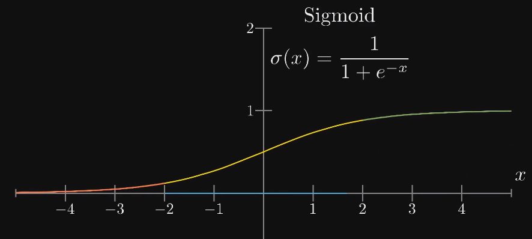

可能我们不想让这个神经元很容易就被激活，所以我们可能会在计算出加权和后再减去一个偏置（bias），再送进sigmoid函数。所以，权重这个参数告诉你这个第二层的神经元关注的是什么像素图案，而偏置则说这个加权和需要多大才能让神经元的激活有意义。

这样，第二层的每一个神经元都有784个权值和对应的一个偏置bias，假设中间网络有两层，每层16个神经元，那么总共可能需要13000个权值加偏置，相当于整个网络上有13000个旋钮开关让你去调整。所以你意识到，我们在说”学习“时，其实是在说应该怎么去设置这么多的参数，才能让它正确的解决问题。

那么多连线看着太复杂了，我们适用数学来将它表达一下。这里的a0表示前一层的神经元组成的向量，a1表示后一层的神经元激活值向量，W矩阵每一行和对应每一个神经元的权值向量，b代表偏置向量。

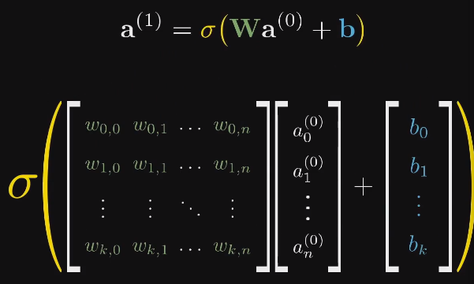

我们将神经元看成一个函数可能更准确一点（因为神经元的值是取决于输入图像的），输入上一层所有神经元的输出，输出一个0~1的值，这样看，整个神经网络就是一个函数，它用了13000个参数计算。在早期的神经网络中大量使用sigmoid，但现在ReLU更好用，在特别深的神经网络上效果很好。

##### 如何学习？

那么现在，我们来学习如何让神经网络去”学习“。我们需要这样一个算法，当我们输入图片和图片对应的标签时，我们希望算法会调整13000个权重和偏置值，以提高该网络对训练数据的表现。我们更希望该网络能够举一反三，识别训练数据之外的图像，这样，当我们使用测试图像作为输入时，根据结果，我们就可以得到一个识别的准确度。形象化来说，当前神经元和前一层网络的每一个权值表示它和前一层的神经元之间的联系有多紧密，而bias则表示该神经元多容易被激活。

在一开始，我们会随机的初始化神经网络中所有的权重和偏置值，可想而知，此时的识别结果会非常糟糕，那么这时，我们需要定义一个代价函数来告诉我们的电脑，结果很糟，具体来说，对于最后输出的10个神经元上的值，我门将其与预期值相减再平方，之后相加，可以得到一个Loss（损失值）。所以我们就要考虑手头上几万个训练样本的代价的平均值要最小，所以，我们实际上就说要找出这个平均值函数的最小值点。

##### 梯度下降

函数的梯度指出了函数的最陡增长方向，所以负的梯度就说函数的最陡下降方向喽。找到函数最小值的算法就是：计算梯度、朝着梯度的负方向前进一小步，接着重复这个过程。具体到这个例子，朝着负梯度方向走一步表示当前的每一个参数要怎么改变自己的值。这里要注意的是代价函数，或者说损失函数，计算的是整个样本的平均值，也就是对于整个样本平均来说最好的结果。这个计算梯度的算法就是神经网络的核心。

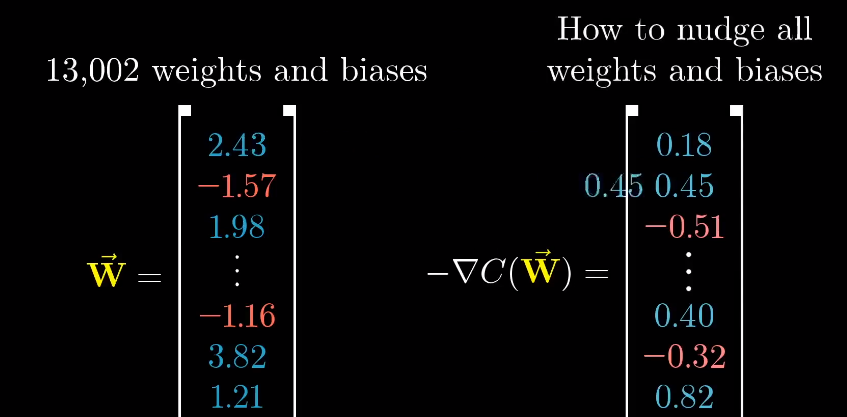

负梯度告诉了我们两件事：1、从符号来，可以看出对应的参数是应该增大还是减小。2、从大小来看，我们可以看出改变哪个参数的影响会更大。

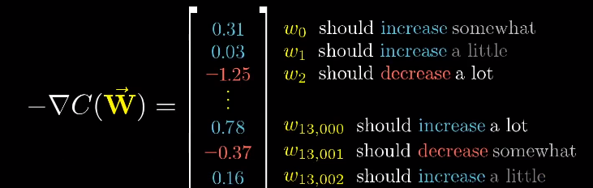

从以上例子来看，神经网络并不是像我们期待的那样，第一个隐藏层识别短边，第二层组合识别部分结构，第三层组合识别数字，神经网络只不过是在13000个参数的深海里找到了一个比较合适的坑坐了下来。比如说，如果我们输入一张神随机的图片，网络也会给我们一个自信的答案。

##### 反向传播算法（用于求解梯度）

首先我们来看看单个训练样本会对整个网络参数造成什么样的影响。

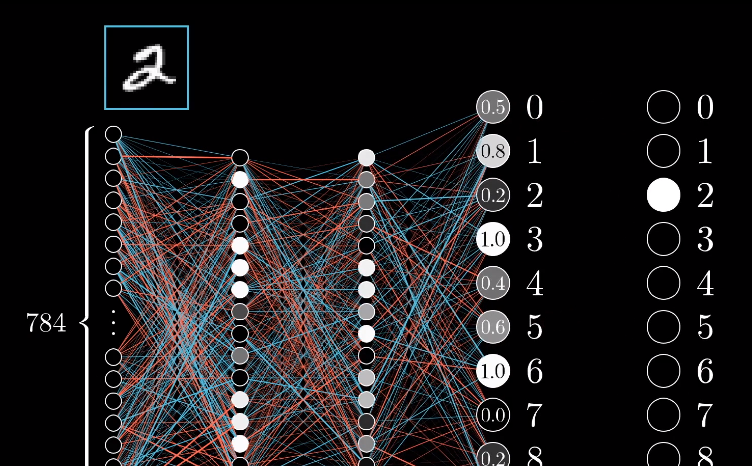

 现在，因为训练样本是2，我们想要识别出2，所以我们希望第三个输出值变大，其他数值变小，并且变动的大小和现在值与目标值之间的差成正比。接下来让我们来具体看看如何增大识别2这个神经元的激活值。

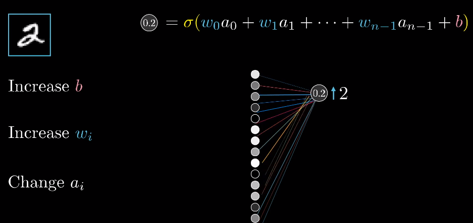

有三种方法可以增大，增大偏置值、增大权重、增大前一层的激活值。首先来看看增加权重。我们可以看出，增加各个权重的影响力不同，增加与前一层较亮的神经元之间的权重影响力更大，因为更亮，所以这些权重会和更大的激活值相乘，结果会更大，所以在这个例子之中，增加更亮的神经元的权重就比增加黯淡的神经元的权重效果要好得多，记住，之前说到梯度下降的时候，我们不仅仅看每个参数是应该增大还是减小，我们还看哪个参数的性价比最高。

第三种增加这个神经元的激活值的方法就是改变前一层的激活值，如果让正权重连接的神经元更亮，所有负权重连接的神经元更暗，这个神经元的激活值就会更大。和改变权重的时候类似，如果我们想要造成更大的影响，就要根据权重的大小对激活值做出成比例的改变。但我们不能直接改变激活值，我们只能改变权重和偏置。

刚刚以上我们讨论的仅仅是数字2的神经元所期待的变化，我们还需要最后一层其余的神经元的激发变的更弱，而这其他的神经元对于如何改变倒数第二层都有它们各自的“想法”。所以，我们会把数字2神经元的期待和其他输出神经元的期待全部加起来，作为如何改变到数第二层的神经元的指示。我们把所有的期待加起来之后，就得到了一串对倒数第二层改动的变化量，接着，我们就可以重复这个过程，改变影响倒数第二层神经元激活值的相关参数，从后一层到前一层，把这个过程一直循环到第一层。这仅仅是单个训练样本，“2”对所有的权重和偏置的影响，所以我们还需要对其他所有的训练样本同样地过一遍反向传播，记录下每个样本想怎样改变权重和偏置，之后对这些权重与偏置取一个平均。

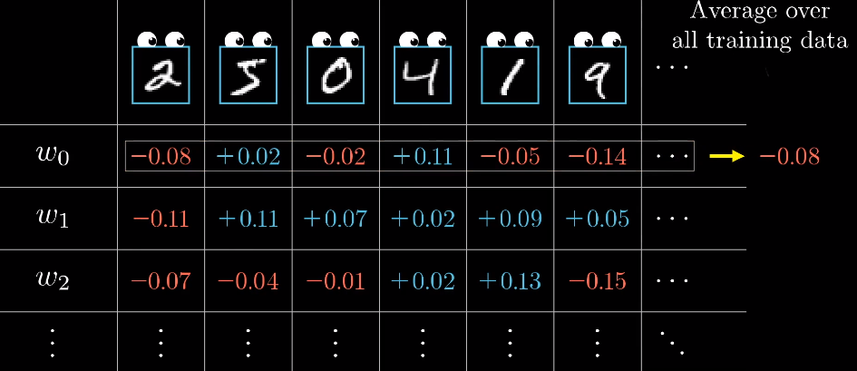

这里一系列权重和偏置的平均微调大小，不严格地来说，就是代价函数的负梯度，或是其标量的倍数。然而，在实际应用中，如果每一步梯度下降都使用全部的训练样本来计算的话，花费的时间就太长了。所以会采取这样一种方式：将训练样本打乱，分成很多组的minibatch，假设每个minibatch是100个，然后你使用minibatch的数据作为你每一步梯度下降的依据，这是一个非常不错的近似，计算量会小很多。

### 什么是梯度?

 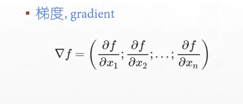

梯度指出了函数的最陡增长方向，梯度下降方法找到局部极小值。

### 常用函数的梯度求解

 掌握基本的求导数的公式。

### 激活函数及其梯度

激活函数：科学家在对青蛙的神经元进行研究中发现，神经元只有在当给定的值计算出来的结果大于某一个值时才会产生一个响应输出，否则不输出结果，之后就定义了这样类似的函数，比如说一些阶梯函数。

#### Sigmoid函数/Logistic函数


当值很小时，趋近于0，不反应；当值很大时，也趋近于稳定，接近于1。此外，该函数很好的将一个取值为无穷大的数压缩在了(0,1)的范围里。

sigmoid函数的导数如下：

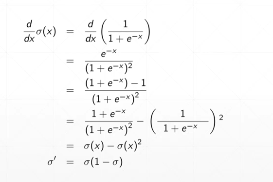

#### Tanh函数

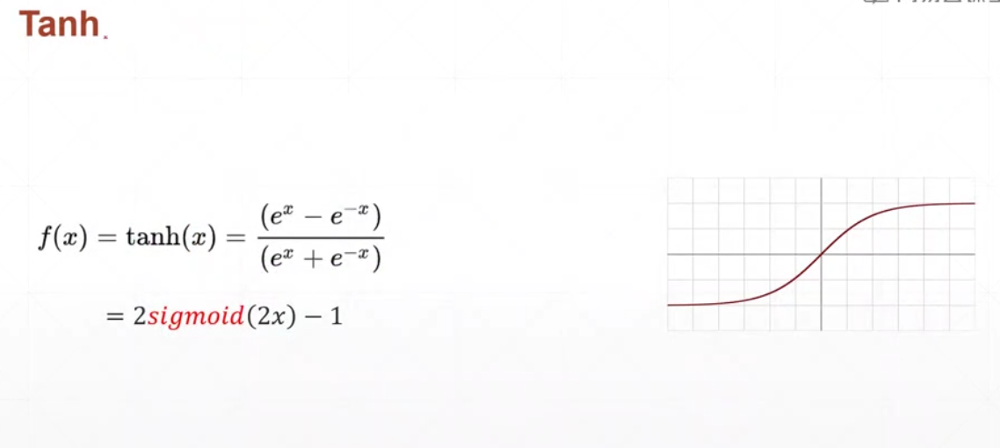

Tanh函数的导数：

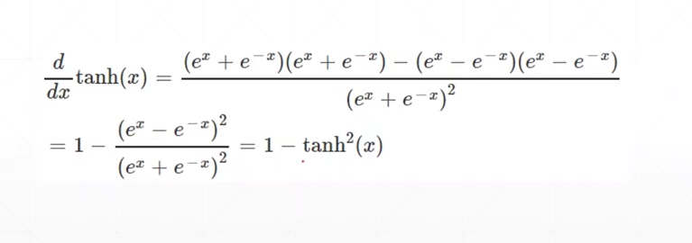

#### Rectified Linear Unit函数

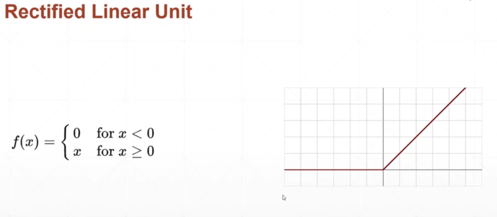

ReLU函数的导数：

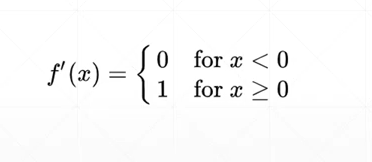

### 典型的Loss函数

- 1、Mean Squared Error - 均方差。
- 2、Cross Entropy Loss。

MSE：


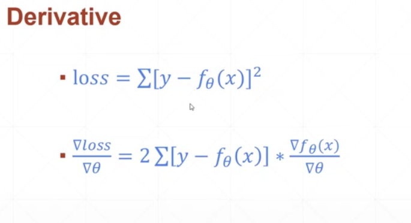

#### 求解梯度的API

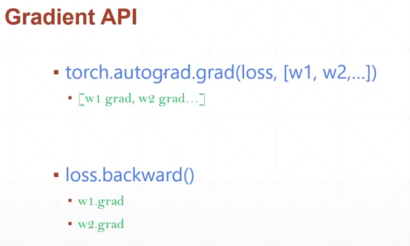

```python
import torch
# 以一个简单的函数为例子: y = x*w + b
x = torch.ones(1)
w = torch.full(size=[1], fill_value=2)
# 导入函数库
import torch.nn.functional as F
# 均方差损失函数
# 第一个参数是预测值，第二个参数是真实值
mse = F.mse_loss(x*w, torch.ones(1))

# 使用autograd函数对loss函数求导
# 这里会报错,是因为我们之前没有指定w需要求导
torch.autograd.grad(mse, w)

w.requires_grad_()
# 此时需要重新计算一下mse
mse = F.mse_loss(x*w, torch.ones(1))
torch.autograd.grad(mse, w)

mse = F.mse_loss(x*w, torch.ones(1))
# 使用backward方法进行求导
mse.backward()
w.grad
```

#### Softmax激活函数

适用于分类问题的激活函数，将输出的值转换为一系列的概率值，且这些概率值的和为1，另外的一个作用就是能够将原来数值大的数放的更大，小一点的数就限制在一个较小的空间。

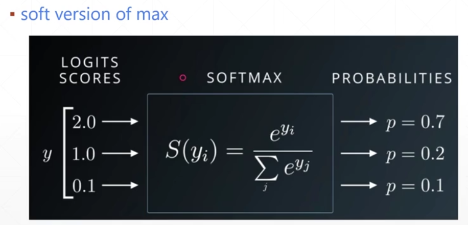

##### 求导结果

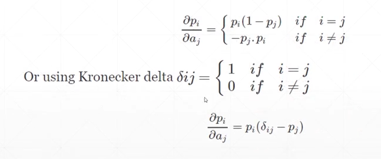

### 感知机的梯度推导

#### 首先看看最简单的一个例子，单层感知机

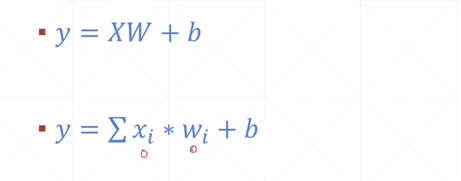

前一层的激活值乘以对应的权重再加上一个偏置就得到了一个预测值。我们使用sigmoid函数来作为它的一个激活函数。

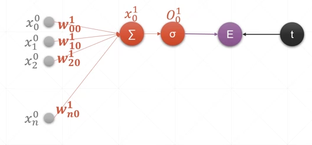

上图所示就是单层感知器模型，求和符号表示前一层的激活值和对应权值的加权和，sigma符号表示使用sigmoid函数，t表示target，也就是目标值，E就表示一个预测值和目标值之差再进行开方。

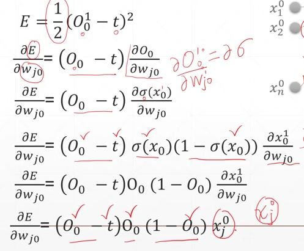

所以：

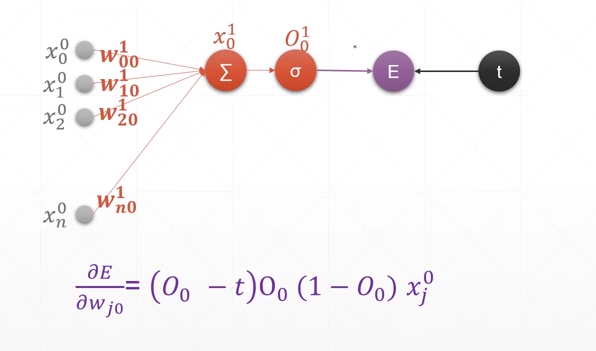

#### 多输出感知器的梯度推导

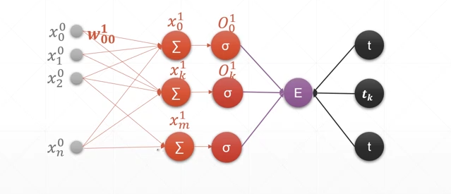

如图，前一层有n个神经元，输出有m个神经元，推导过程如下图所示：

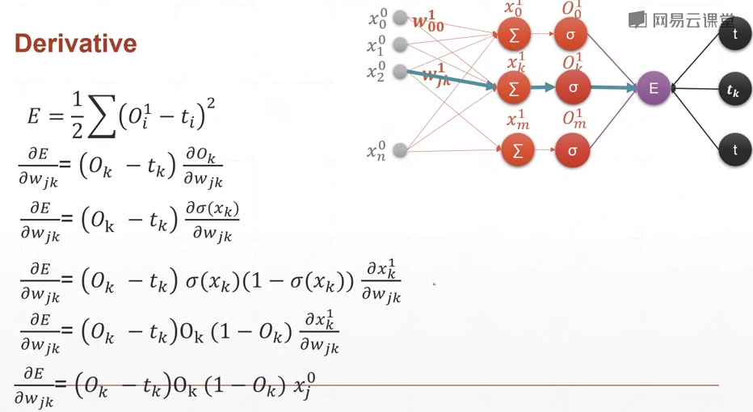

从结论可以看出，偏导数只和与权值相连接的两个神经元有关（蓝色的连线）。

#### 链式法则

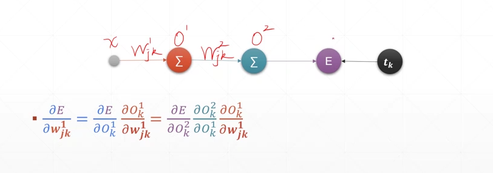

复合函数的求导（链式法则）。