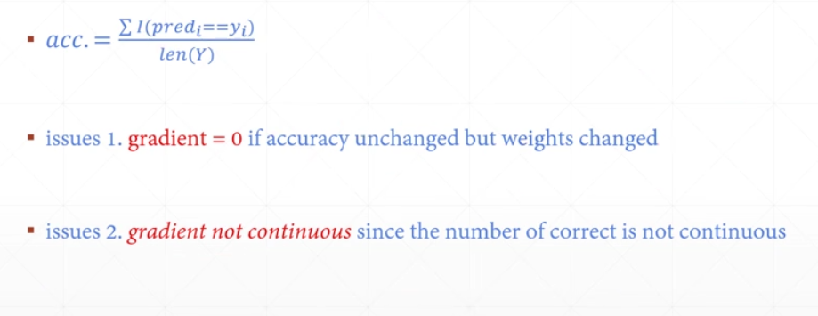
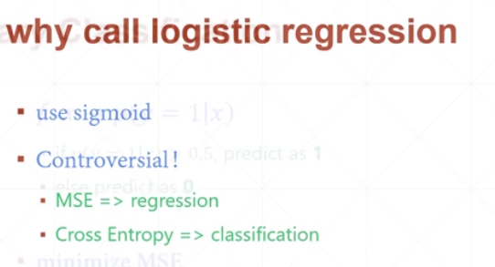
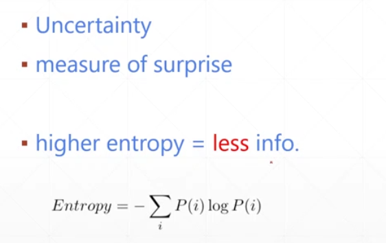
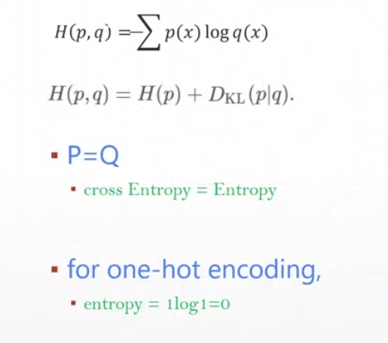

### Logistic Regression

sigmoid 函数又称为 logistic 函数，logistic regression是用来做分类任务的。对于分类任务，我们不能使用准确率作为代价函数，会出现两个问题：梯度为0和梯度不连续。

为什么叫：logistic regression呢？

### 交叉熵（和softmax函数匹配的loss函数）

熵表示了一种不确定性，表现了一种惊喜度。

熵是衡量一个分布的不稳定度H(p)，交叉熵是衡量两个分布的不稳定度，H(p, q)。当p等于q时，就变味了p的熵，当采用0,1 encoding 时，也就是输出的可能性数组为 `[0, 0, 1, 0, 0]`，熵就为0，交叉熵就变为了KL散度。q表示预测出来的分布，p表示实际的分布。

