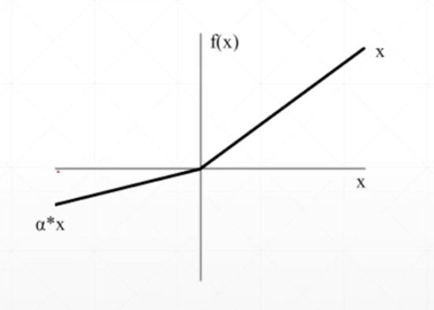
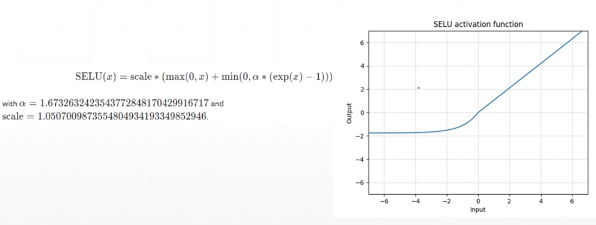
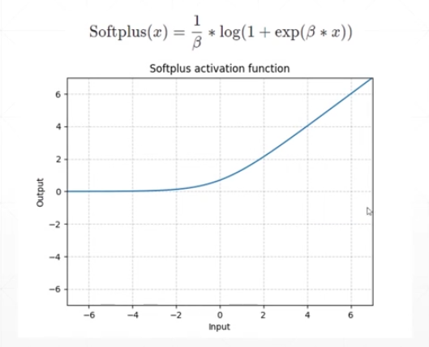
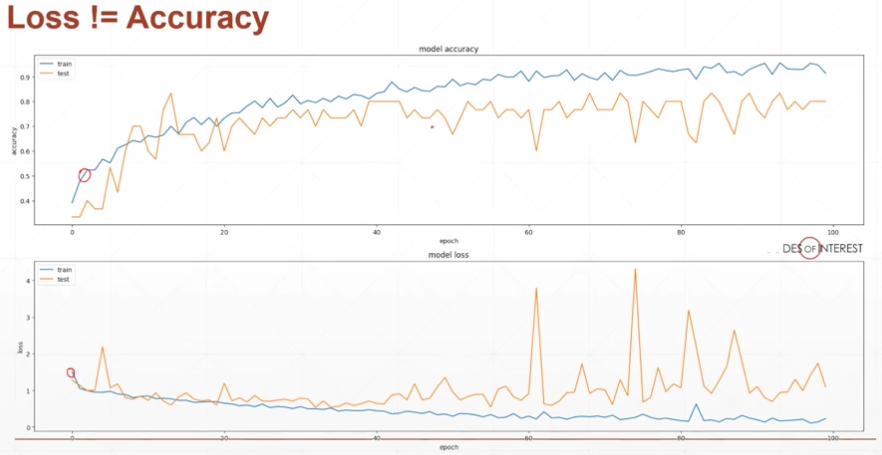

### Logistic Regression

sigmoid 函数又称为 logistic 函数，logistic regression是用来做分类任务的。对于分类任务，我们不能使用准确率作为代价函数，会出现两个问题：梯度为0和梯度不连续。

为什么叫：logistic regression呢？

### 交叉熵（和softmax函数匹配的loss函数）

熵表示了一种不确定性，表现了一种惊喜度。

熵是衡量一个分布的不稳定度H(p)，交叉熵是衡量两个分布的不稳定度，H(p, q)。当p等于q时，就变为了p的熵，当采用0,1 encoding 时，也就是输出的可能性数组为 `[0, 0, 1, 0, 0]`，熵就为0，交叉熵就变为了KL散度。q表示预测出来的分布，p表示实际的分布。

### 激活函数和CPU加速

#### Leaky ReLU

能帮助我们在x小于0时仍然有个较小的梯度，不至于卡在那里。

#### SELU函数

两个函数拼接而成。

#### softplus函数

将原来不连续的地方做了一个平滑的处理。

### 测试的重要性

从上图可以看出，训练的模型的loss不等于准确度，我们需要有测试来对我们的模型真实情况做一个评估，训练的多了不代表你的模型一定效果就很好，一般来说，训练的数据量和模型的架构决定了训练的效果。如何做准确度测试呢？我们可以使用`argmax`函数来对结果进行一个处理，返回了对应的预测的标记，和真实预测的标记进行一个比较，计算出预测对的数量，除以预测的总数量，就得到了一个准确度。

### 可视化的操作

