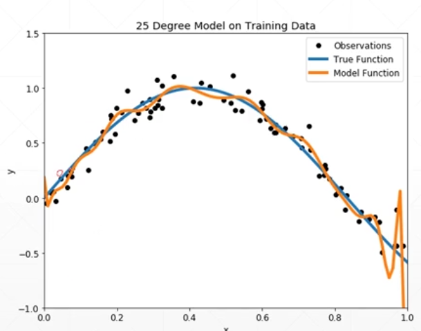
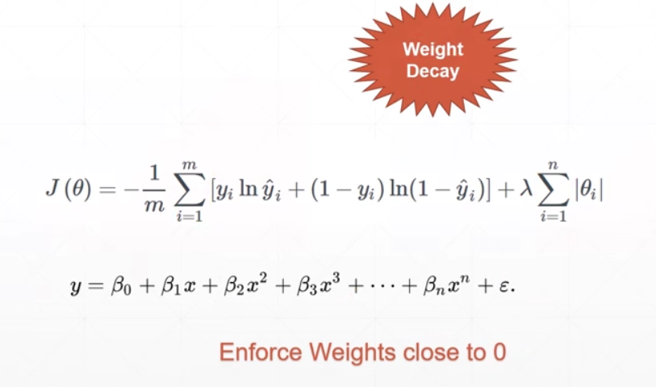
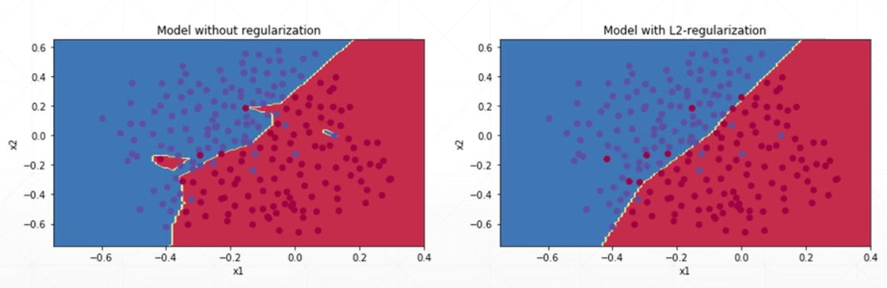
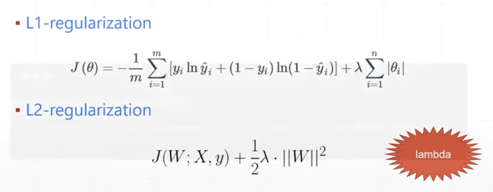
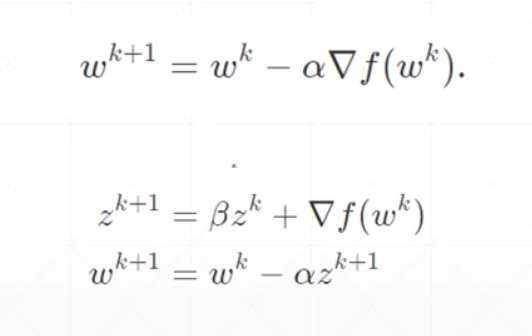
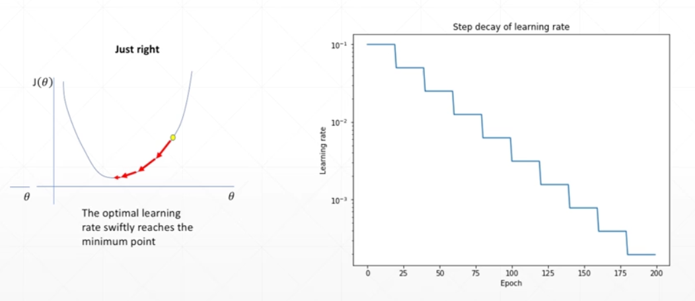
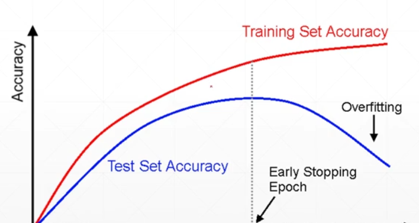

### 过拟合和欠拟合

过拟合（over-fitting），所建立的模型在训练的样本中表现的过于优越，但对于验证数据集和测试数据集表现不佳，而欠拟合则是训练的效果不太好，测试效果也不太好。

### 交叉验证

将数据集划分为训练集和测试集，如果模型在训练集上的效果好，而在测试集上的效果表现很差的话，就有可能是出现了过拟合。

分为三个数据集（训练集、验证集、测试集），测试集不会给出，防止作弊。

K-fold 交叉验证，就是指在训练时的每一次`epoch`，对数据随机的划分为训练集和验证集，这样可以防止模型“死记硬背”，将数据划分为N份，每一次从N份中选取一份作为验证集合，剩下的作为训练集，不过这种方法使用的不是特别多，因为对模型的效果提升不太显著。

### 正则化

奥卡姆剃刀原理：如无必要，勿增实体。

减少过拟合的一些方法：

- 更多的数据
- 约束模型的复杂度（正则化）
- Dropout
- Data argumentation
- Early Stopping

正则化（Regularization）就是在损失函数后加上一项，迫使权重参数减小，比如说一个简单的网络，有7个参数（w1, w2, w3 ... , w7），在加上那一项之后会使得某些参数变得很小，如0.01这样，就会退化为只有几个参数，从而降低了模型的复杂度。

直观的理解

L1正则化和L2正则化

### 动量和学习率衰减

momentum，考虑了上一次的梯度的方向。

learning rate decay，学习率动态的逐步减小。

### Early stop

在测试时表现最好的点处停下来，防止过拟合。怎么做呢？设置一个验证集选择参数，监视验证的表现，在表现最好的点处停止。

### Drop out

在每个权重上在加一个概率，可能让这个权重变为0的概率，这样在传播时就有可能使这个连接断掉，所以在训练时就会减少参数量。

### Stochastic gradient descent

将整个数据集上的梯度变为一个batch上的梯度。