### 什么是卷积？

#### 图片的表示

我们可以先看看图片在计算机中是怎么表示的，比如说mnist数据集中的手写数字图片，是28*28的矩阵，矩阵的每一个点表示了一个灰度值，0~255，白色为255，黑色为0。

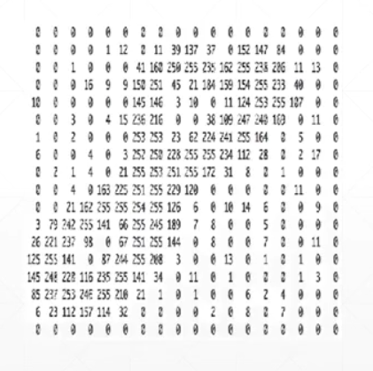

对于彩色图片，采用三通道（R，G，B）的方式来存储，也就是采用三张表，每一张表存储一个通道的数据。

#### 早期神经网络的问题

在早期，线性神经网络（全连接）存在的问题，比如说，下图：

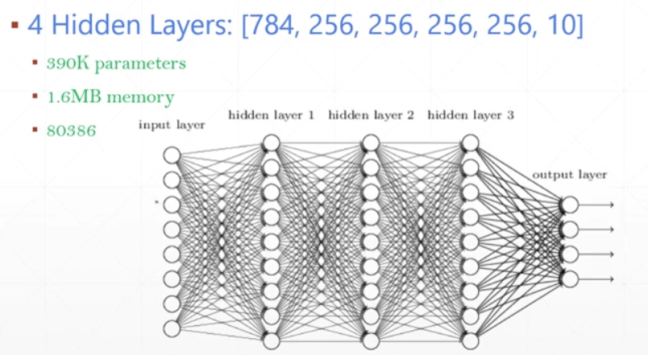

对于手写数字识别来说，如果使用`[784, 256, 256, 256, 256, 10]`这样的神经网络结构，需要的参数量就是784`*`256 + 256`*`256 + 256`*`256 + 256`*`256 + 256`*`10，差不多有390K的参数，所以对于早期的计算机来说，数据量太大了，无法实现。后面科学家就联想到人看东西，当人们看东西的时候，虽然视野里有很多东西，但是往往只会着眼于局部的一点，就是局部视野。

#### 局部相关

局部连接的神经网络，每个神经元只和自己附近的输入进行连接，就是局部相关。

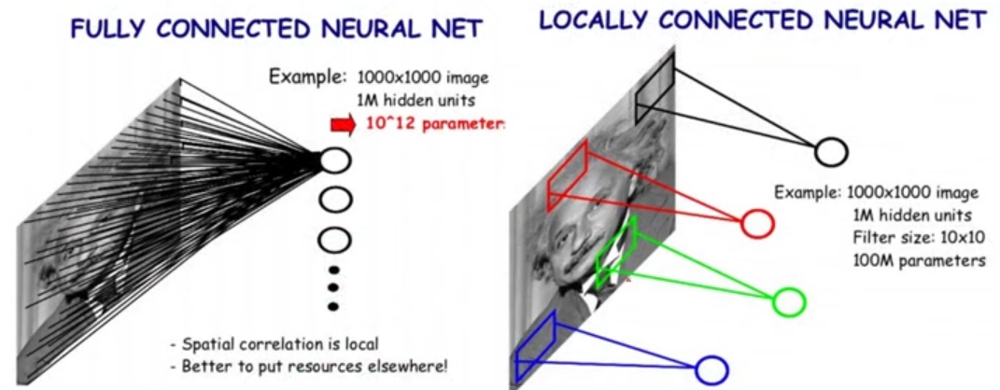

#### Whole CNN

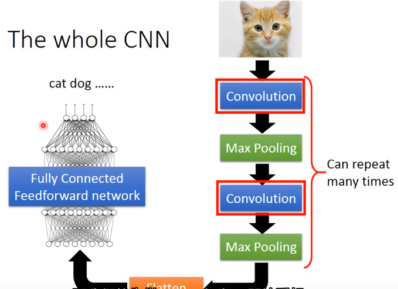

#### 卷积操作

假设要识别的图片是6`*`6的，有多个Filter（一个个的矩阵），里面的参数都是要去学习的，那么卷积操作是怎么做的呢？一第一个Filter为例，首先将它放到左上角，做矩阵的内积运算（对应数相乘，结果累加），之后，向右移动一步stride，直到边界后往下移动一个stride，直到图片的末尾。

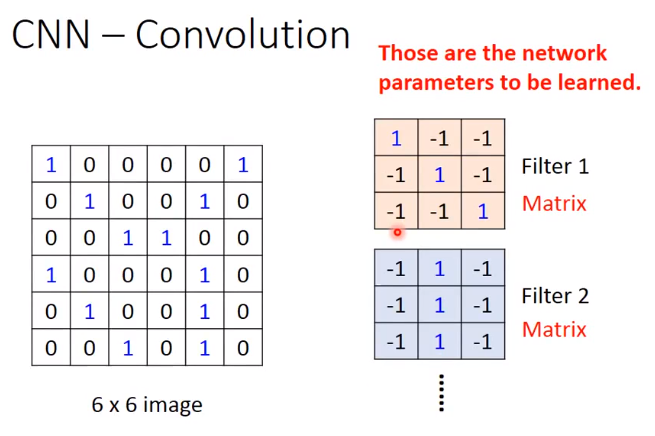

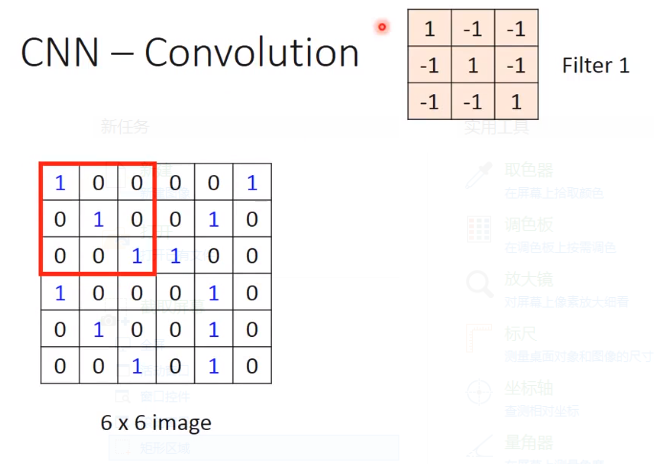

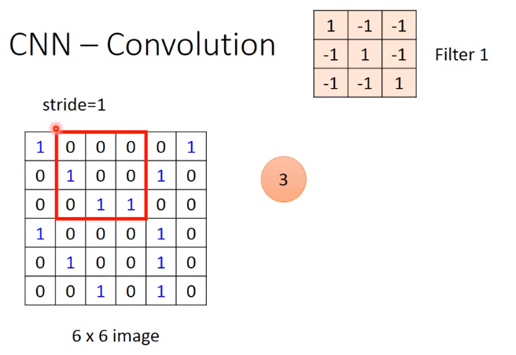

最后就得到了一个feature map。

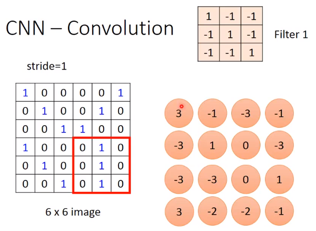

彩色图片：

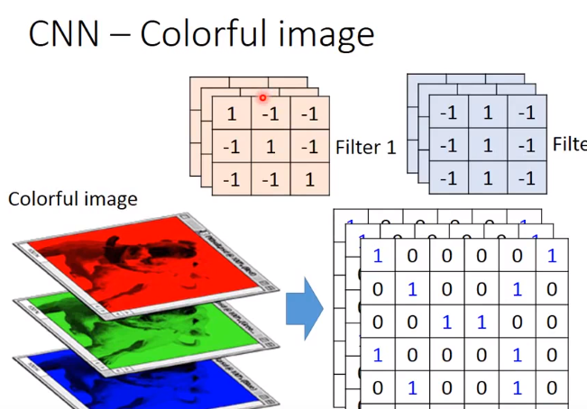

其实这个卷积操作就是神经网络，我们考虑把6*6的图片拉直，前一层神经元的值就是图片每个像素的值，只不过减少了权值，比如后一层的"3"，只和前面的"123 789 13.14.15"有关系，且不同的神经元之间权值共享。

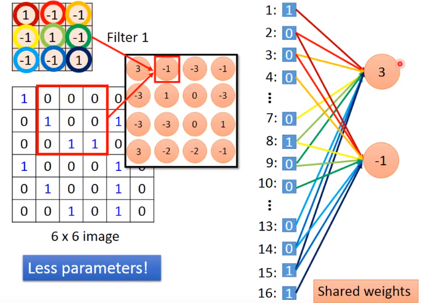

### Max Pooling 池化操作

将原来得到的feature map 四个一组的划分，选其中最大值（或平均值），合成一个值。

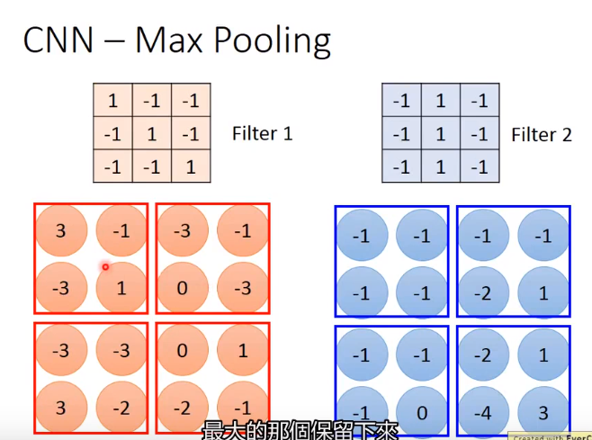

所以在经过一次卷积运算和池化运算之后，就产生了一张新的图片，这张新的图片比输入小。

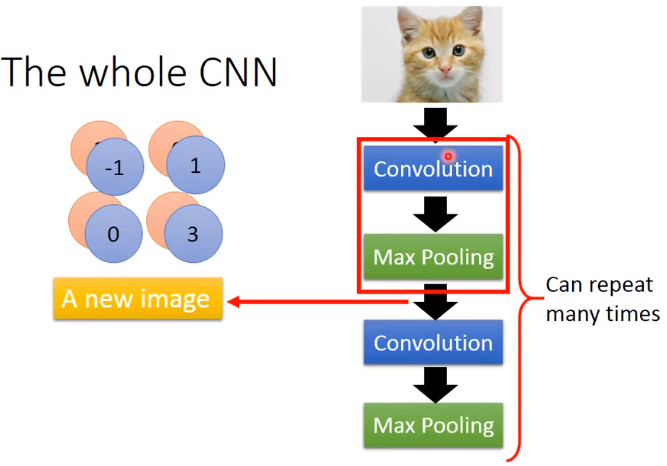

最后就是flatten和全连接层。

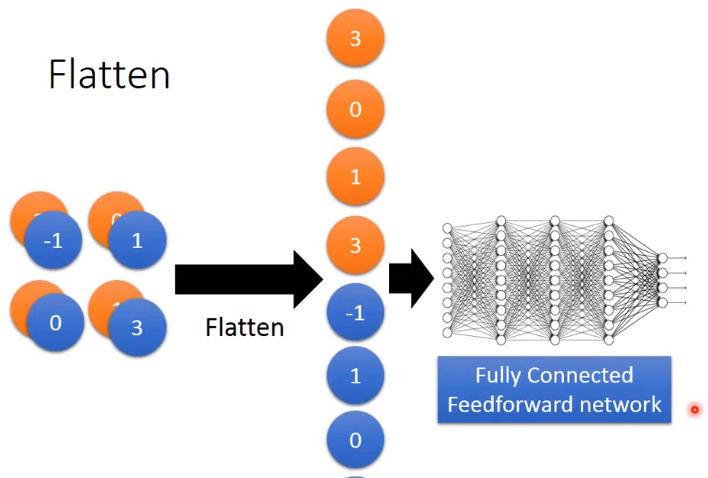